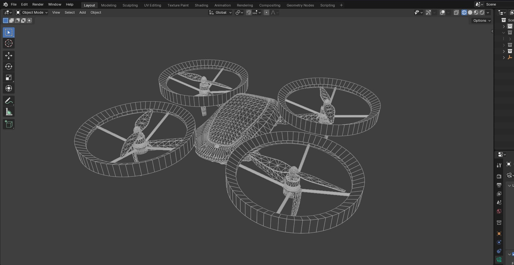

# Life Fly

> **Slogan:** Flying for health and humanity


## 🚀 Overview

The idea for **Life Fly** began during the COVID-19 pandemic, a time when hospitals faced unprecedented challenges. Despite my aspiration to become a doctor, my journey took a different path, leading me to explore how technology could revolutionize healthcare. **Life Fly** is the realization of that dream, combining innovative concepts to address critical challenges in global healthcare.

### **Mission Statement**
To harness the power of technology to save lives by addressing two critical healthcare challenges: **organ transportation** and **emergency medical intervention.**

## ✨ Features

### **1. Ultrafast Organ Transport Drone**
- **Purpose:** To reduce the time between organ retrieval and transplantation, thereby improving transplant success rates.
- **Capabilities:**
  - Operates faster than traditional transportation methods.
  - Accesses remote areas, offering hope where resources are scarce.

### **2. Intelligent Medical Assistant**
- **Equipped with advanced sensors:**
  - **Infrared sensor:** Measures body temperature.
  - **Controlled-pressure cuff:** Monitors blood pressure.
  - **Optical sensors:** Measure glucose levels and heart rate.
  - **Pulse oximeter:** Tracks oxygen saturation.
- **Data processing:**
  - Real-time data visualization.
  - Automatic generation of detailed reports sent to healthcare professionals for analysis.

### **3. Humanitarian Impact**
By bridging gaps in medical infrastructure, **Life Fly** provides critical support in emergencies, particularly in areas with limited medical resources.

## 📜 Origin Story
At the age of 16, amidst the challenges of the COVID-19 pandemic, I envisioned a project that would leverage technology to transform healthcare. This vision became a reality during my second year at university, where I pitched this idea at the **Student Entrepreneurship Hub**. Today, Life Fly stands as a testament to the belief that technology must serve humanity.

## 🎥 Media & Resources

### **Videos & Images:**
- [Organ Transport Drone Demo](./assets/videos/drone.gif)
- [Intelligent Medical Assistant Overview](./assets/videos/robot.gif)
- **Starting Design of the Drone:**
  

### **Certificate:**
View the certificate of participation in the entrepreneurship event [here](./Certif.jpg).

## 🌍 Impact Goals
- Increase transplant success rates by reducing transportation times.
- Provide critical support in medical emergencies.
- Democratize healthcare access in underserved areas.

## 🏆 Achievements
- **Pitched at:** Student Entrepreneurship Hub (Year 2).
- **Recognized for:** Innovation in leveraging technology for healthcare.

## 📂 Repository Structure
```plaintext
LifeFly/
├── assets/
│   ├── images/
│   │   ├── drone1.jpg
│   │   ├── drone2.jpg
│   │   ├── demoDrone1.jpg
│   ├── videos/
│   │   └── lifefly trailer.mp4
│   │   ├── drone.gif
│   │   └── robot.gif
│   │   └── drone.mp4
│   │   └── robot.mp4
├── Certif.jpg
├── lifefly1 [Autosaved].pptx
├── LICENSE
├── README.md
```

## 🤝 Contribution
Contributions are welcome! Please feel free to fork this repository, open an issue, or submit a pull request with your ideas or improvements.

## 👍 License
This project is licensed under the MIT License - see the [LICENSE](./LICENSE) file for details.

## 📞 Contact
For any inquiries or feedback, please reach out to **taysirbouzidi123@gmail.com**.

---

### "Technology must serve humanity. Together, let's transform healthcare and save lives."

**Disclaimer:** This project represents a conceptual idea and is protected under intellectual property laws. Unauthorized use or duplication is prohibited.

© 2024 Life Fly. All rights reserved. The content, images, and concepts in this repository are proprietary and cannot be used without permission.

